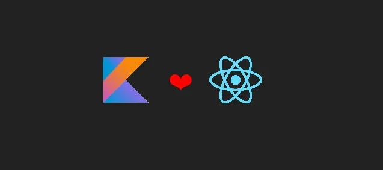

<!--Header Name-->
#  ɪ'ᴍ Grégoire!
*Digital Craftsman (Developer / Programmer)*
 

<!--Start Intro-->               

I am a Full Stack Developer React.js, Node.js, Kotlin, Java, REST API. 

Here are some ideas to get you started:

- 🔭 I’m currently working on TodoApp with React
- 🌱 I’m currently learning React and Kotlin
- 📫 How to reach me: X(Twitter), (LinkedIn)
- ⚡ Fun fact: I'm former sports coach and dev x++
